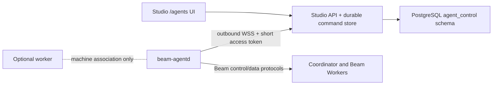

# Beam Studio agent control

Beam Studio can control a standalone `beam-agentd`, or an agent hosted on the
same logical machine as a transfer worker. The worker is an optional topology
association; it is never a proxy for agent control.



The WebSocket is primarily a control plane. Tunnel bytes, MLS ciphertext,
objects, and streams continue to use the Beam fabric. For an explicitly opened
message-channel view, the managed agent may also deliver decrypted room
messages through a bounded ephemeral sub-protocol. Studio routes those bytes in
memory to the authenticated browser session and never writes them to commands,
events, PostgreSQL, NATS, logs, or telemetry. No inbound port is required on the
agent machine.

## Enrollment and connection

1. In **Agents**, select **Connect an agent**. Studio creates a ten-minute,
   organization-scoped, one-time code and stores only its SHA-256 hash.
2. Run the displayed `beam tunnel studio connect` command on the machine.
3. `beam-agentd` creates an Ed25519 key pair locally, posts the public key and
   code to `/agent-control/v1/enroll`, and stores its private state owner-only.
4. For every connection, the agent signs a fresh nonce and timestamp. Studio
   verifies proof of possession and returns a five-minute access token.
5. The agent opens `/agent-control/v1/connect` as outbound WSS and sends
   `agent.hello` immediately. Studio records version, platform, capabilities,
   cursors, presence, and a monotonic session generation.

Outside loopback development, the Studio origin must use HTTPS/WSS with normal
server certificate validation. Enrollment codes are not credentials and
cannot be reused.

## `studio-agent-control/v1`

Every JSON envelope contains `protocolVersion`, `type`, `messageId`, `sentAt`,
and `payload`, and is limited to 256 KiB. Agent messages are `agent.hello`,
`agent.heartbeat`, command state events, bounded `agent.event`,
`channel.subscribed`, `channel.delivery`, `channel.publication`,
`channel.error`, and `agent.goodbye`. Server messages are `server.welcome`,
`command`, `session.replaced`, `policy.updated`, `server.ping`,
`channel.subscribe`, `channel.unsubscribe`, and `channel.publish`.

Commands are persisted before dispatch and follow:

```text
queued -> dispatched -> accepted -> running
       -> completed | failed | cancelled | expired
```

Each command carries a monotonic sequence, expiry, idempotency key, payload
fingerprint, and session generation. A new connection fences every older
session. If a socket disappears while a command is accepted or running, the
next authenticated session requeues it. The agent's durable journal returns
the existing result instead of repeating the side effect.

Supported operations cover endpoint/tunnel/destination lifecycle, durable
operations, room metadata (memberships, roles, channels, and grants), bounded
redacted logs, and metrics. Shutdown and identity key generation/signing are
not exposed.

## Persistence and isolation

`packages/db/src/beam-studio-target-schema.sql` owns the PostgreSQL
`agent_control` schema: machines, agents, enrollments, credentials, replay
nonces, sessions, commands, events, and audit events. All Studio reads and
mutations resolve the authenticated user's active organization. Agent
credentials are stored as hashes; access tokens are signed and short-lived;
private keys never enter Studio.

Room message envelopes are never passed to `appendAgentEvent` and never receive
a durable event sequence. The process-local Agent Gateway multiplexes one agent
subscription per `(agent, room, channel)` across active browser clients. The
subscription is cancelled when its final browser disconnects.

## Ephemeral message-channel sessions

The authenticated browser connects to
`/studio/agents/:agentId/rooms/:roomId/channels/:channelId/connect`. Before
opening the bridge, Studio verifies organization access, the managed agent's
`room-messages` capability, and current channel visibility through read scopes
on the coordinator's delegated control plane. Only `message` channels are
accepted.

Publications use
`application/vnd.beam.channel-message+json; version=1`, a browser-generated
client message ID reused as the BTR idempotency key, a 32 KiB text ceiling, and
the BTR `none` persistence mode. The agent remains the cryptographic publisher.
Studio displays its local publication optimistically because BTR fanout excludes
the publishing member, then reconciles accepted, delivered, partial, skipped,
failed, and expired receipt counts from the agent.

The first version is live-only. Reconnection creates a fresh subscription and
does not claim replay or history. `sender_local` and `receiver_local` remain
delivery persistence contracts and are not reinterpreted as chat history.

This makes the managed Studio API a trusted, transient content processor for
the duration of an explicitly opened channel view. The coordinator and Beam
Workers remain unable to read plaintext. A deployment that cannot accept this trust
boundary must disable the channel view until a browser-specific secondary
encryption protocol is available.

Command and event results returned to the UI are recursively redacted for
tokens, credentials, private/identity keys, leases, and secrets. Revocation
atomically revokes the agent credentials and sessions, then closes the active
socket.

## Local and organization policy

The agent persists the authoritative local allowlist: filesystem roots after
symlink resolution, tunnel kinds, network targets, public exposure permission,
maximum tunnels, operation concurrency, command TTL, and room-control enablement.
An organization policy received with `policy.updated` is intersected with the
local policy and can only reduce access.

## Direct coordinator delegation for Rooms

Studio forwards the authenticated OAuth bearer it already uses for the selected
organization to the coordinator. The coordinator validates that bearer against
the Beam API, then exchanges it for an Ed25519-signed token that expires within
five minutes and is bound to the Studio organization, one managed agent, and
the minimum scope required by one request. The OAuth bearer, delegated token,
agent BTR credential, and agent private keys never reach the browser.

The coordinator resolves the agent identity from its own credential registry
and reapplies the agent's active room membership before returning room,
membership, role, or channel data. Studio cannot provide a principal identity
or widen a token's scope. Delegated writes are limited to room creation/close,
invitations, roles, channel metadata, and grants. Each write requires an
idempotency key and is recorded as a completed delegated command in Studio.
Joining/leaving, membership renewal, channel activation, assignments, payload
traffic, local endpoints, and cryptographic operations continue through the
outbound agent command channel.

When Studio creates a room while the managed agent is offline, the coordinator
remains authoritative. `beam-agentd` discovers its coordinator memberships at
startup and every five seconds, fetches the authorization snapshot for any
unknown room, and persists the adopted room before normal renewal and refresh.
This keeps the agent's local state convergent without giving Studio its bearer
credential.

Both the global Rooms inventory and the Rooms tab on an agent consume this
coordinator-backed read model. The global inventory includes every room owned
by the selected organization, including rooms created outside Studio. An
authenticated Studio may perform room, invitation, role, channel, and grant
metadata actions on any of those organization-owned rooms. The agent tab
filters the shared snapshot by managed agent ID instead of rendering a durable
`room.list` command result, so expired or previous-enrollment memberships
cannot remain visible in only one of the two views.

Room operations resolve the coordinator through Beam environment templates.
Public/default Studio mode hides template controls and forces the built-in PROD
template. A deployment that sets `BEAM_STUDIO_DEV_SETTINGS_ENABLED=true`
exposes template management in General Settings and ships built-in PROD and
DEV templates. Deployed templates must use public HTTPS coordinator URLs, such
as PROD `https://coordinator.b1m.ai`.
Room control has no static credential. User-initiated requests obtain their
coordinator delegation with the user's Beam Auth session bearer. Work without a
user session (V3 resolution, execution authorization, Web Agent controller
provisioning, transfer evidence, storage jobs, consumer bootstrap, MCP) uses an
organization Beam API key that Studio already stores: the run's execution key or
the storage job's key when available, otherwise the organization's default
billing key. The coordinator verifies the key with the Beam API.
Without any stored organization key, room control reports
`room_authority_key_unavailable`.
Configure the coordinator with
`BEAM_TUNNEL_BEAM_API_URL` (or `BEAM_API_URL`) so it can validate the forwarded
bearer. Managed BTR agent credentials should include `organization_id`; rooms
created through BTR are persisted with that same organization ID. That field
identifies room ownership only: a member from a different organization may join
when the invitation and room membership rules allow it. Studio organization
inventory and metadata snapshots may be read by matching `organization_id`, and
the same match authorizes owner-level room, invitation, role, channel, and grant
metadata actions. Object metadata, payload access, assignments, membership
lifecycle actions, and cross-organization room reads remain membership-scoped.

For the containerized Room consumer, configure the Studio API with a dedicated
`BEAM_STUDIO_SHARED_SECRET`. The consumer enrolls for
`BEAM_STUDIO_CONSUMER_ORGANIZATION_ID` when it is set (the hosted deployment),
otherwise for the instance owner organization; an unclaimed instance, or an
organization with no stored Beam API key, answers a retryable
`503 instance_unclaimed` or `503 room_authority_key_unavailable` and the
consumer retries. Self-hosted releases run it as the `room-consumer` Compose
service (see docs/self-update.md). The consumer only receives the Studio API
URL and shared bootstrap secret. It generates its Beam key locally, receives a
key-bound coordinator enrollment plus a one-time Studio enrollment, and then
redeems both itself. When the consumer connects, the rooms it already belongs to
are reconciled with its Member and Admin roles, allowing it to subscribe and
manage MLS for every Room owned by its organization. Every consumer attach
waits for a `room.refresh` command that makes the agent load the Room; an
offline consumer or a failed refresh is reported as `room_consumer_offline` or
`room_consumer_not_ready` (see [Studio room consumer](studio-room-consumer.md)).
The shared secret is not used for the long-lived WebSocket or Room data paths.

`POST /studio/rooms` resolves an online consumer before asking the coordinator
to create the room, because the coordinator commits the room credit as soon as
the room exists. When the organization has no enrolled consumer, or the
coordinator authorizes none of them, Studio answers
`409 room_consumer_unavailable` with `details.reason` set to `not_enrolled` or
`not_authorized`. When every authorized consumer is offline, it answers
`409 room_consumer_offline` with `details.reason` set to `offline`. In each case
it never sends the billable create.

## Deployment and recovery

Set `BEAM_STUDIO_AGENT_TOKEN_SECRET` to a high-entropy secret. If absent, the
API uses `BEAM_STUDIO_SECRET_KEY`; production startup fails when neither is
available. Rotating this server-side signing secret does not require a new
enrollment: agents request another short token with their Ed25519 proof.

The current `InMemoryAgentConnectionRegistry` makes connection ownership
explicit but process-local. Run one active Agent Gateway instance. PostgreSQL
durability and session fencing are ready for a future distributed registry,
but multi-instance socket routing is not currently claimed.

Recovery procedures:

- transient API/network loss: the agent reconnects with bounded jittered
  backoff and resumes durable cursors;
- lost local agent credential/key: revoke the agent in Studio and enroll a new
  identity;
- suspected compromise: revoke immediately; new token proofs and WebSockets
  are rejected;
- stuck non-terminal command: reconnecting requeues it until expiry; terminal
  results remain visible in the agent activity page.

## Verification

`pnpm test:agent-control` creates an ephemeral PostgreSQL database and server,
then covers one-time enrollment, signed authentication, outbound WebSocket,
online presence, session replacement/fencing, persisted tunnel command,
disconnect, redelivery without a duplicate side effect, remote close, strict
organization isolation, and revocation.

## Workflow room commands

For admitted `workflow-graph/v3` room-member actions, the Studio API is the
server-side controller. It connects to the standalone Web Agent `/v1/connect`
with `beam.web-agent.v1`, authenticates with an instance credential held only in
the API process, and publishes `room-action/v1` envelopes through
`message.publish.private`. A dedicated two-member MLS `message` channel joins
the controller member and each executor member. The channel declares the exact
content type `application/vnd.beam.room-action+json; version=1`; the Web Agent
checks the two-member roster while encrypting or decrypting. The workflow's
request-reply channel remains the separate authorization scope for the action.

Configure `BEAM_STUDIO_WEB_AGENT_CONTROLLERS` as a JSON array of
`{organizationId,roomId,agentId,memberId,url,origin,credential,channels}`.
Provide it to the API container through the deployment's own environment
configuration.
`channels` maps each executor member ID to its pairwise control channel ID.
The URL must be WSS (or loopback WS) ending in `/v1/connect`, and `origin` is
the exact allowed Studio API origin. A room has one configured controller
binding; the controller and every selected executor must hold live grants on
both relevant channels. The API never returns this credential or the Web
Agent administration session to browsers. The private API permits a 160 KiB
plaintext action envelope. Provision the dedicated MLS action channel with
`limits.max_payload_bytes` of at least 256 KiB for ciphertext headroom. Studio
checks that declared limit at launch and assignment; the Web Agent checks the
actual limit at publication.

The API persists command identity, authority generation, original deadline,
transport state, and the executor reply before settling the assignment. A
publication with an uncertain outcome is never repeated as `action.invoke`.
After a controller restart or a reply grace period, published commands with no
terminal result also enter reconciliation; MLS room messages have no replay
guarantee. The API sends separately identified `action.reconcile` probes with
bounded backoff, and allows an old generation only for result and cleanup
reconciliation. After 24 hours without conclusive cleanup, the delivery is
marked blocked for operator review.
Agent control socket dispatch excludes these protected commands. Studio and
the two authorized MLS members can inspect action inputs and results; the
coordinator and Beam Workers carry only ciphertext.

The V3 launch gate requires a configured controller and checks the frozen
distribution against current room membership, grants, executor capabilities,
and supported scheduling shapes. Runs without that readiness evidence remain
closed. V1 and V2 commands retain their existing agent control transport.

Room transfers use the canonical workflow task claim and the same durable agent
command journal. The API constructs publish/cancel payloads from the locked
workflow snapshot and binds them to one publication key. Agents advertise
`room-workflows/v1`, enforce coordinator enrollment and filesystem roots, and
retain cancellation tombstones. Status reads use scoped coordinator service
access, so an offline source does not hide Core's terminal outcome.
Transfer bytes move between outbound agent connections and the selected
Worker-hosted direct runtime as `btr.object.chunk.aead.v1` ciphertext. Object
channel MLS keys and plaintext remain in source and destination agents; the
Studio control WebSocket and API do not proxy them.
See [Room transfer workflows](room-transfer-workflows.md) for configuration,
credential deployment, cancellation reconciliation, and verification boundaries.
